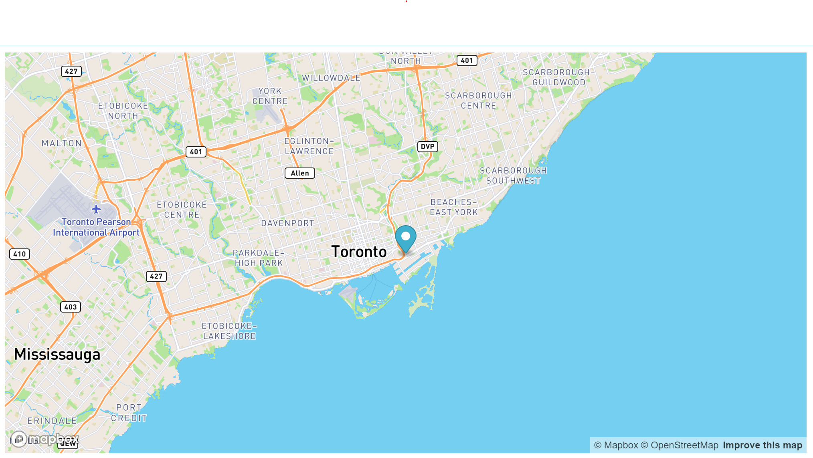

# svelte-mapbox-ts (SMAT)

SMAT is a really minimal svelte implementation of [mapbox-gl](https://github.com/mapbox/mapbox-gl-js), written in Typescript. Based on https://gitlab.com/jailbreak/svelte-mapbox-gl/-/tree/master.

## Usage

Install SMAT: `yarn add smat`.

Example:

```svelte
<script lang="ts">
	import { LngLat } from 'mapbox-gl';
	import { Map, Marker } from 'smat';

	const startingLocation = new LngLat(-79.347015, 43.6532);
</script>

<div>
	<Map accessToken="YOUR_ACCESS_TOKEN" options={{ center: startingLocation, zoom: 10 }}>
		<Marker coordinates={startingLocation} />
	</Map>
</div>

<style>
	div {
		width: 1000px;
		height: 500px;
	}
</style>
```

Result:



Note: you must wrap the map in something with a width and height, since it's defaulting to 100% for both.

## Development

Once you've created a project and installed dependencies with `yarn`, start a development server:

```bash
npm run dev

# or start the server and open the app in a new browser tab
npm run dev -- --open
```

## Building

Just run:

```bash
yarn package
```

This will build the contents of the `src/lib` folder.
